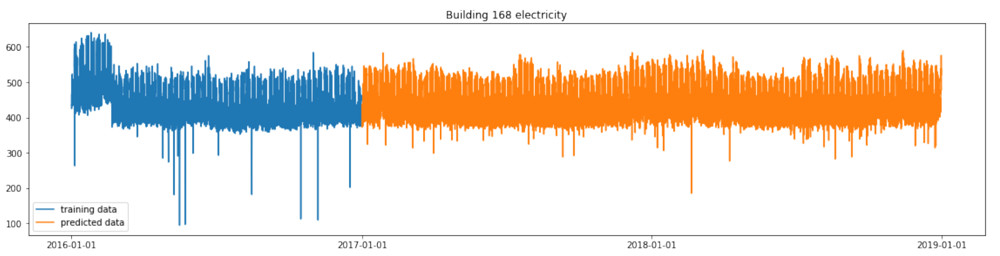
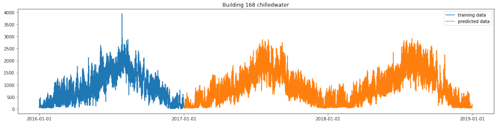
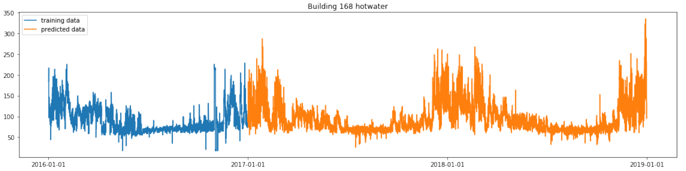
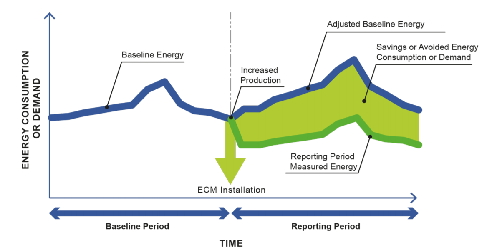
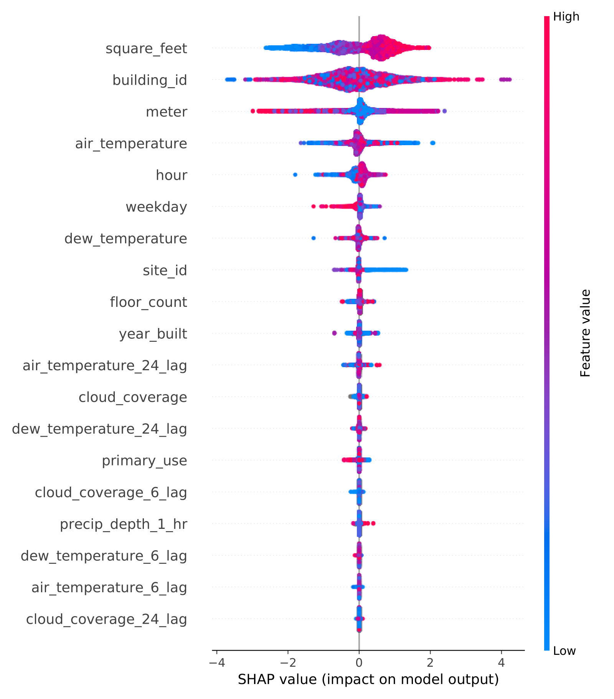
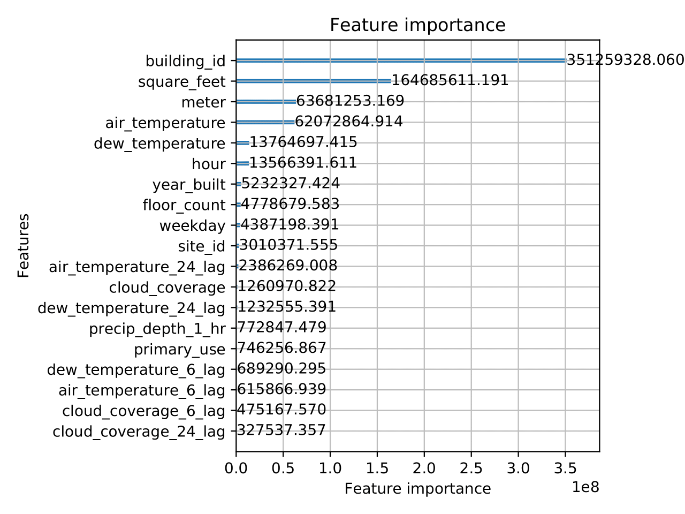

# Energy Consumption Prediction

<!-- START doctoc generated TOC please keep comment here to allow auto update -->
<!-- DON'T EDIT THIS SECTION, INSTEAD RE-RUN doctoc TO UPDATE -->

Table of Content:


- [1. Executive Summary](#1-executive-summary)
- [2. About the Project](#2-about-the-project)
- [3. The Dataset](#3-the-dataset)
  - [3.1. Exploratory Data Analysis](#31-exploratory-data-analysis)
- [4. Walk Through the Project](#4-walk-through-the-project)
  - [4.1. Install Dependencies](#41-install-dependencies)
  - [4.2. The Dataset](#42-the-dataset)
  - [4.3. Data Cleaning and Preprocessing](#43-data-cleaning-and-preprocessing)
  - [4.4. Feature Engineering](#44-feature-engineering)
  - [4.5. Build Models](#45-build-models)
  - [4.6. Hyperparameter Tuning](#46-hyperparameter-tuning)
  - [4.7. Make Predictions](#47-make-predictions)
  - [4.8. Evaluation & Prediction](#48-evaluation--prediction)
- [5. Data Leaks](#5-data-leaks)
- [6.Project Structure](#6project-structure)
- [7. References](#7-references)

<!-- END doctoc generated TOC please keep comment here to allow auto update -->


## 1. Executive Summary

**Goal:**

To predict 2 years (2017-2018, 40 mio~ rows) of electricity usage with 1 year (2016, 20 mio~ rows) of data for training. The evaluation metrics is RMSE.

**Results:** 

LightGBM achieved the lowest RMSE (1.278), about 3.8% less accurate the Kaggle topic winner solution (1.231). Example prediction results for building No. 168 as below:








## 2. About the Project

This project comes from the Kaggle competition [ASHRAE Energy Prediction](https://www.kaggle.com/c/ashrae-energy-prediction). The goal of this project is straightfoward - How much energy will a building consume?

From the publication <i>More Buildings Make More Generalizable Models—Benchmarking Prediction Methods on Open Electrical Meter Data</i>. Clayton Millor pointed out "A period of baseline energy consumption is used to create a machine learning prediction model to evaluate how much energy a building would use in a status quo baseline mode. An energy conservation measure (ECM) is installed and the difference between the baseline is the avoided energy consumption or demand. This process is crucial for the implementation of energy savings implementations as it gives building owners, designers and contractors a means of evaluating the success of such measures."



For this project the host provided the 2016 electricity used data for more than 1000 building across the world, and ask competitors to predict the next two year's meter readings. Then the host is able to obtain best modeling solutions that can be used to predict future savings of the energy after ECM installation.

This project is meaningful because with better estimates of these energy-saving investments, large scale investors and financial institutions will be more inclined to invest in this area to enable progress in building efficiencies.


## 3. The Dataset

The provided data consists of ~20 millions. rows for training (one year timespan) and ~40 mio. rows for testing (two years timespan). The target variable are the hourly readings from one of four meters {0: electricity, 1: chilledwater, 2: steam, hotwater: 3}. For building the model the data provides following features out of the box:


- building_id --> Foreign key for the building metadata.
- meter ---> The meter id code. Read as {0: electricity, 1: chilledwater, 2: steam, hotwater: 3}
- timestamp --> Hour of the measurement
- site_id --> Identifier of the site the building is on
- primary_use ---> Primary category of activities for the building 
- square_feet --> Floor area of the building
- year_built ---> build year of the building
- floorcount - Number of floors of the building

Further weather data has been provided, which comes with air_temperature, cloud_coverage, dew_temperature, precip_depth_1_hr, sea_level_pressure, wind_direction and wind_speed.


### 3.1. Exploratory Data Analysis

Profiling for each data file:

- [building_meta.csv profiles](https://georgehua.github.io/energy-consumption-prediction/building_metadata_profile.html)
- [train.csv profiles](https://georgehua.github.io/energy-consumption-prediction/trainset_profile.html)
- [weather_train.csv profiles](https://georgehua.github.io/energy-consumption-prediction/weather_train_profile.html)

[In-depth analysis: ](https://georgehua.github.io/energy-consumption-prediction/EDA.html)
 - Checking missing data
 - Identifying outliers
 - Observing time-series trend
 - Finding correlation


## 4. Walk Through the Project

The the project follows the standard workflow of machine learning project:
- Data Preparation
- Feature Engineering
- Model Training & Hyperparameter Tuning
- Prediction & Evaluation

Note: This project run on python >= 3.6


### 4.1. Install Dependencies

    ```
    # 1. Clone the project
    git clone https://github.com/georgehua/energy-consumption-prediction.git
    
    # 2. Install project dependencies
    
    # It's recommended to create a virtual environment first, a good option is to use pipenv package
    pip install pipenv
    pipenv shell
    pipenv install -r requirements.txt
    
    # Or you can install everything gloabally
    pip install requirements.txt
    ```


### 4.2. The Dataset

   The raw data has to be placed in `data/raw`. A good practice is to download the data via the Kaggle CLI.
    ```
    kaggle competitions download -c ashrae-energy-prediction
    mkdir -p data/raw
    unzip ashrae-energy-prediction.zip -d data/raw
    ```


### 4.3. Data Cleaning and Preprocessing

    ```
    python src/data/preproc.py data data/interim
    ```

   `preproc.py` will create a clean dataframe for analysis. This script includes: 
   - Load all associated `.csv`-files
   - Timestamps alignment based on building location. 
        - The original time is in UTC, we need to align them to their local time because time of the day is crucial to predict energy consumption (consider lightening, heating, etc.)
   - Iterative imputation for missing values in weather data. 
   - Join all dataframes and save compressed results in `data/interim`


### 4.4. Feature Engineering

    ```
    python src/features/build_features.py data data/processed
    ```
    `build_features.py` will conduct the feature engineering process. The result is saved in `data/processed`. This script includes: 
    - Encode all categorical features
    - Encode wind direction (cyclic encoding - cosine)
        - Inspired by: https://stats.stackexchange.com/questions/148380/use-of-circular-predictors-in-linear-regression
    - Extract time based features (time-series pattern on energy usage)
        - hour
        - weekday
        - month
    - Create new features based on existing information: 
        - area_per_floor
        - log_transformed_square_feet
        - log_transform_area_per_floor
        - age_of_buildings
        - relative_humidity
        - feels_like_temperature
        - add lag windows 6, 24 days
    - Labeling outliers: var < mean - 2.5 * std | var > mean + - 2.5 * std
    - Exlucde wrong readings (data anomly)
    - Drop faulty rows
        - Credit for: https://www.kaggle.com/purist1024/ashrae-simple-data-cleanup-lb-1-08-no-leaks


### 4.5. Build Models

    ```
    python src/models/train_model.py <MODEL_NAME> <MODE> data/processed models/<MODEL_NAME>
    
    # Example:
    python src/models/train_model.py lgbm cv data/processed models/lgbm
    ```
    In this script I set up the training program for three ML models LightGBM, CatBoost and XGBoost. From the experiments, the LightGBM renders the best results. At the end of each training, the models will be safed in the equally named directory.
    - `MODEL_NAME` : 
        - lgbm (LightGBM)
        - ctb (CatBoost)
        - xgb (XGBoost)
    - `MODE`: 
        - cv (cross validation, default, best one)
        - full (no validation set, single fold)
        - by_meter (training by meter type)
        - by_building (training by building id)


### 4.6. Hyperparameter Tuning

   ```
    python src/models/find_hyperparameter_lgbm.py
   ```
   For tuning hyperparameter, I used Bayesian optimization to reduce the time spent on traditional grid-search or random-search.
   Note: This step is time-consuming and requires large RAM space.


### 4.7. Make Predictions

   ```
    python src/models/predict_model.py data/processed <MODEL_NAME> <MODEL_PATH> submissions/submission.csv
   
    # Example:
    python src/models/predict_model.py data/processed lgbm models/lgbm_cv/ submissions/submission.csv
   ```
   Note: the testing set contains 40 millions rows, and requires large memory space to process.

   The result is a `.csv` file, which is dumped in the `submission` directory and is ready for uploading to Kaggle.

   - `MODEL_NAME` : 
        - lgbm (LightGBM)
        - ctb (CatBoost)
        - xgb (XGBoost)
   - `MODEL_PATH`: the directory of the saved models or the model itself.


### 4.8. Evaluation & Prediction

The RMSE score on test set is 1.278, and I consider the result as a success (the winner is 1.231, so my solution is 3.8% less accurate than the top solution). There might be some factors influence the results that out of my control:
- The test set is separated into public and private score board (a convention of the Kaggle competition), and scoring participants separately. But there might be bias during the separation process.
- I didn't use leaked buildings data, but many participants did.


**Sample predictions for building No.168**


**Shapley Values Plot**

This shows the Shap values on the x-axis. Here, all the values on the left represent the observations that shift the predicted value in the negative direction while the points on the right contribute to shifting the prediction in a positive direction. All the features are on the left y-axis.

So here, high square feet values are on the right side primarily because they contribute positively to the meter readings.



**LightGBM Feature Importance**

The plot uses LightGBM to calculate feature importance and have the similar functionality to Shapley values.




## 5. Data Leaks


Unfortunately a portion of the test labels have been leaked, which stirred the whole competition. Someone located the building in the real world and pulled the actually electricity readings to include in their submission file. And almost all the top winner's solution used the leaked data.


## 6.Project Structure


    ├── README.md          <- The top-level README for developers using this project.
    ├── data
    │   ├── external       <- Data from third party sources.
    │   ├── interim        <- Intermediate data that has been transformed.
    │   ├── processed      <- The final, canonical data sets for modeling.
    │   └── raw            <- The original, immutable data dump.
    │
    ├── docs               <- Github Pages documents & figures
    │
    ├── models             <- Trained and serialized models, model predictions, or model summaries
    │
    ├── notebooks          <- Jupyter notebooks for EDA and experiments
    │
    ├── requirements.txt   <- The requirements file for reproducing the analysis environment, e.g.
    │                         generated with `pip freeze > requirements.txt`
    │
    ├── setup.py           <- makes project pip installable (pip install -e .) so src can be imported
    ├── src                <- Source code for use in this project.
    │   ├── __init__.py    <- Makes src a Python module
    │   │
    │   ├── data           <- Scripts to download or generate data
    │   │   └── preproc.py
    │   │
    │   ├── features       <- Scripts to turn raw data into features for modeling
    │   │   └── build_features.py
    │   │
    │   ├── models         <- Scripts to train models and then use trained models to make
    │   │   │                 predictions
    │   │   ├── predict_model.py
    │   │   └── train_lgbm_model.py
    │   │   └── train_ctb_model.py
    |   │   └── train_xgb_model.py
    │   │   └── find_hyperparameter_lgbm.py
    │   │
    │   └── visualization  <- Scripts to create exploratory and results oriented visualizations


## 7. References

[Python notebook using data from ASHRAE - Great Energy Predictor III, ASHRAE -Start Here: A GENTLE Introduction](https://www.kaggle.com/caesarlupum/ashrae-start-here-a-gentle-introduction#Model-in-%E2%9A%A1%F0%9F%94%8CASHRAE-:-Lgbm-Simple-FE)

[Miller, C. More Buildings Make More Generalizable Models—Benchmarking Prediction Methods on Open Electrical Meter Data. *Mach. Learn. Knowl. Extr.* **2019**, *1*, 974-993. https://doi.org/10.3390/make1030056](https://www.mdpi.com/2504-4990/1/3/56)

